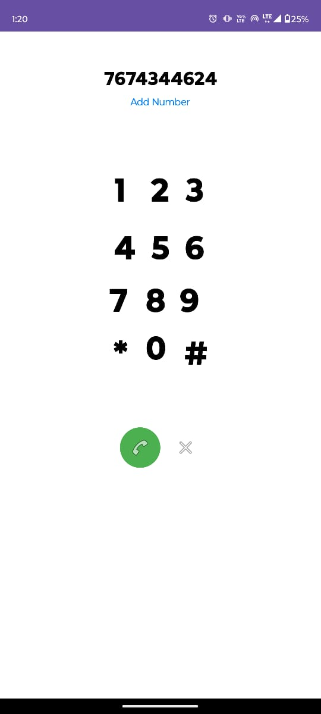

# 📱 My Android App - CallMood 🤝

Welcome to **CallMood**, a modern Android application designed to simplify your mood and enhance user calling experience .  
Built with ❤️ using **Kotlin** and **XML** on **Android Studio**.

---

## ✨ Features

- 🧘 Yoga Sessions Guide
- 🔢 Questions and Quiz Module
- ☎️ In-App Dialpad
- 👤 Profile Management
- 🔒 Secure SignIn and SignUp
- 🎨 Smooth UI/UX Design

---

## 🚀 Tech Stack

- **Language:** Kotlin
- **UI Layouts:** XML
- **IDE:** Android Studio
- **Database:** Shared Preferences

---

## 🖼️ Screenshots

<p align="center">
  
  &nbsp;&nbsp;&nbsp;
  
</p>

<p align="center">
  
  &nbsp;&nbsp;&nbsp;
  
</p>

<p align="center">
  
  &nbsp;&nbsp;&nbsp;
  
</p>

<p align="center">
  
</p>

---

## 🛠️ How to Install and Run Locally

1. **Clone the repo**
   ```bash
   git clone https://github.com/your-username/your-repository-name.git
